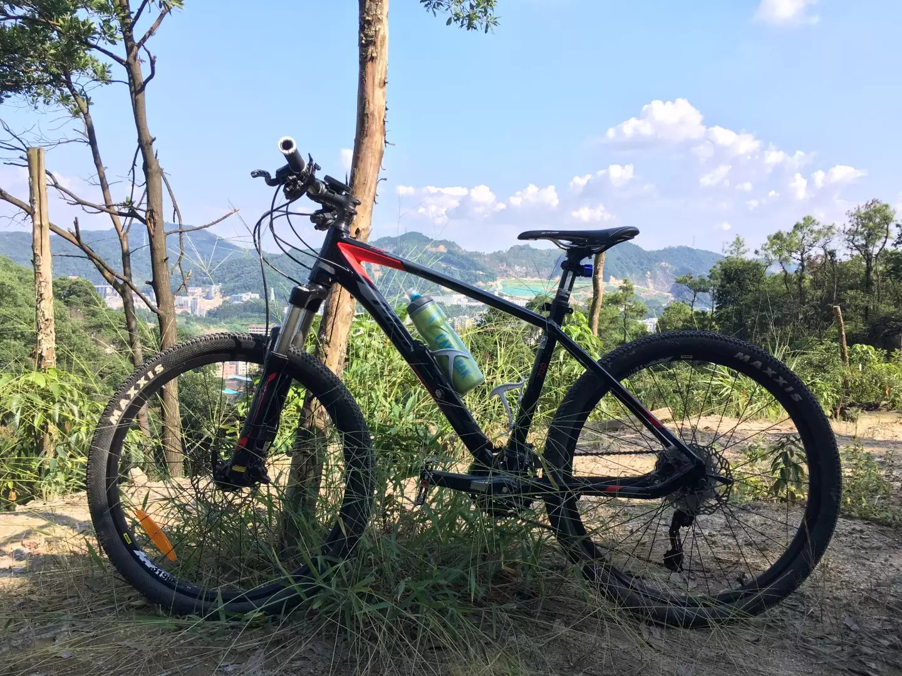

Hello. 我呢!二流的学校毕业,来自三线城市的四线县城的小破农村.但是能我现在一线城市混啊!哈哈!!  
在妖都的一家外地公司的本地事业部上班,公司主要社保业务.我呢负责着一些系统的开发和运维工作,每天朝九晚六到九这样.觉得这样的日子没多大意思得充充电找新出路了.  
我的各种资料可以在[LinkedIn](http://www.linkedin.com/in/莫振顺)找到.

I currently work at [Figma](https://www.figma.com/) building the next-generation interaction design tool.

<!-- [Some of my favorite technical papers &rarr;](https://www.dropbox.com/sh/is0sy5350lr4v9j/AADQlhVSQcRw6vCNKQgGWelqa) -->
## Elsewhere

你可以通过如下途径找到我(如果你是妹纸可以顺便都关注一下)

- [Twitter](http://twitter.com/juneday0623) — 如果你也在墙外的话可以关注一些,虽然我不怎么更新
- [Instagram](http://instagram.com/juneday0623/) — 跟上面一样,如果有我觉得比较好的照片我会更新一下
- [GitHub](https://github.com/callmess) — code, 基本就是代码啦,目前还比较单薄,正在培育中...
- [WeChat](spotify/wc.jpg) — 请用手机扫右下角 
 * email  — [ilxj20@163.com](mailto:ilxj20@163.com?subject=sen to Moss&body=邮件内容) [面试邀请什么的请戳这里](mailto:ilxj20@163.com?subject=sen to Moss&body=邮件内容)

### [ @juneday](http://twitter.com/juneday0623)
